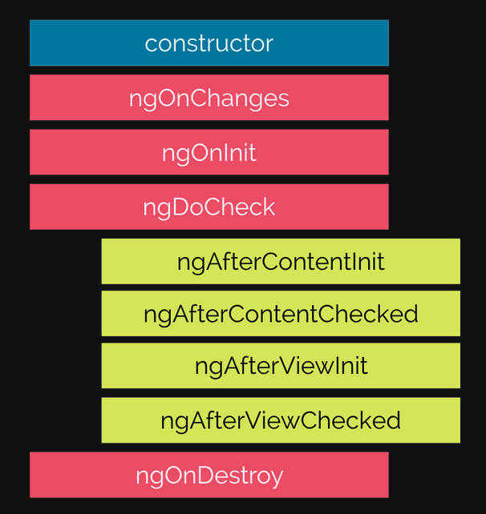

A component includes a template, which is the HTML markup used to describe its visual layout and behavior.

- Composition and lifecycle of a component
    
    Components have a lifecycle that begins with their initial instantiation, and continues with their rendering until they’re destroyed and removed from the application
    
    - Composition of component
        - Requirements
            - @Component() : component metadata decorator, every component must be annotated with @Component(), the annotation contain some properties
            - Template: define layout and content of the UI that user can see.
            - Controller: contains all the properties and methods for the component
        - Optional Injection modifier
            - Inputs: Components can accept data being passed to them using the component.
            - Providers and hosts: Services can be injected directly into a component if they’re not already provided at the root module level.
            - Lifecycle Hooks
        - Optional Output modifier
            - Lifecycle Hooks: During the rendering and lifecycle of a component, you can
                              use various hooks to trigger application logic to execute. For example, you can
                              run initialization logic once during the instantiation of the component and tear
                              down logic during the destruction. You can also use these hooks to bring data
                              into the component, so lifecycle hooks work well with both inputs and outputs
            - Styles and encapsulation
            - Outputs: Outputs are properties that are linked to events that can be used to listen for data changes
            - Animations: components can include a set of CSS styles that are meant to apply only to the component

- Lifecycle of component: 
    Components have a lifecycle from creation to removal
    - Component registered with the module
    - Template includes a component
    - Component is instantiated
    - Controller constructor() called
    - Compiler renders any child components in template
        - Component lifecycle hooks begin
        - When component needs to be updated repeat again
    - Application state changes
    - Component removed from view(When component is no longer needed)

- Lifecycle hooks: 
These hooks are useful when you need
to know that certain conditions are true before executing the code, such as ensuring
that child components have been initialized, or when changes are detected. with prefix ng
    - contructor: 
    - OnChanges: Fires any time the input bindings have changed. It will give you an
                 object (SimpleChange) that includes the current and previous
                 values so you can inspect what’s changed. This is most useful to read
                 changes in binding values.
    - OnInit: This runs once after the component has fully initialized (though not
              necessarily when all child components are ready), which is after the
              first OnChanges hook. This is the best place to do any initialization
              code, such as loading data from APIs.
    - DoCheck : Any time that change detection runs to determine whether the applica-
                tion needs to be updated, the DoCheck lifecycle hook lets you imple-
                ment your own type of change detection.
    - AfterContentInit: When any content children have been fully initialized, this hook will
                        allow you to do any initial work necessary to finish setting up the con-
                        tent children components, such as if you need to verify whether con-
                        tent passed in was valid or not.
    - AfterContentChecked : Every time that Angular checks the content children, this can run so
                            you can implement additional change detection logic.
    - AfterViewInit :This hook lets you run logic after all View Children have been initially
                     rendered. This lets you know when the whole component tree has fully
                     initialized and can be manipulated.
    - AfterViewChecked: When Angular checks the component view and any View Children
                        have been checked, you can implement additional logic to determine
                        whether changes occurred.
    - OnDestroy: Before a component is completely removed, the OnDestroy hook
                     allows you to run some logic. This is most useful if you need to stop
                     listening for incoming data or clear a timer.
    Summary lifecycle hooks
        -   Creating a component
        -   Rendering a component
        -   Creating and rendering its child components
        -   Checking data-bound properties
        -   Destroying and removing it from DOM
        
                
        - ngOnChanges( ) — It is called before ngOnInit( ) and whenever one or more data-bound input properties change. It detects simple changes in the property values.
        - ngOnInit( ) — It initializes the directive/component after Angular displays the data-bound properties and is called once after ngOnChanges( ).
        - ngDoCheck( ) — Changes that are not detected by Angular itself are detected and resolved by it. It is called every time a change is detected and immediately after ngOnChanges() and ngOnInit( ).
        - ngAfterContentInit( ) — Respond after Angular projects external content into the component’s view / the view that a directive is in. It is called once after the first ngDoCheck( ).
        - ngAfterContentChecked( ) — After the content is projected in the component, this method responds. It is called after ngAfterContentInit( ) and every ngDoCheck( ).
        - ngAfterViewInit( ) — It responds after Angular initializes the component’s views and child views / the view that a directive is in. It is called once after the first ngAfterContentChecked( ).
        - ngAfterViewChecked( ) — Respond after Angular checks the component’s views and child views / the view that a directive is in.Called after the ngAfterViewInit( ) and every subsequent ngAfterContentChecked( ).
        - ngOnDestroy( ) — Cleanup just before Angular destroys the directive/component. Unsubscribe Observables and detach event handlers to avoid memory leaks.Called just before Angular destroys the directive/component.
        
The OnInit , OnChanges , and OnDestroy hooks are the most commonly used lifecycle hooks.

The DoCheck , AfterContentChecked , and AfterViewChecked hooks are most
useful to keep track of logic that needs to run during any change detection process, and
respond if necessary
